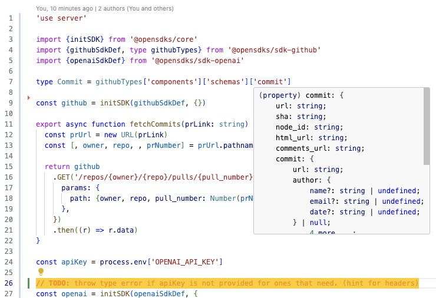

  <a href="https://opensdks.org">
    <picture>
      <source media="(prefers-color-scheme: dark)" srcset="website/public/logo-light.png">
      
    </picture>
    <h1 align="center">OpenSDKs</h1>
  </a>

  
  
  
  

## Features

- ✅&nbsp; End-to-end type-safety for all third-party SDKs you consume
- 🧙‍♂️&nbsp; Easily add any SDKs that you want to use. 
- 🐎&nbsp; Snappy DX - quick type lookup without leaving the code editor. 
  

## Getting Started

Visit <a aria-label="opensdks learn" href="https://docs.opensdks.org/quickstart">https://docs.opensdks.org/quickstart</a> to get started with OpenSDKs. 

## Documentation

Visit [https://docs.opensdks.org/introduction](https://docs.opensdks.org/introduction) to view the full documentation.

## Examples

Check out the example "summarize GitHub PR with OpenAI" app under [`examples/sum-pr`](https://github.com/useVenice/openSDKs/tree/main/examples/sum-pr). Demo link is here [https://what-did-we-work-on.vercel.app//](https://what-did-we-work-on.vercel.app//). 

https://github.com/useVenice/openSDKs/blob/a3281e910c489fbeb7c70787a3fe6da5ca5f525f/examples/example.ts#L1-L128

https://github.com/useVenice/openSDKs/blob/a3281e910c489fbeb7c70787a3fe6da5ca5f525f/examples/summarize-pr.ts#L1-L54

## Community

The OpenSDKs roadmap can be found on [GitHub Projects](https://github.com/orgs/useVenice/projects/2). 

To chat with other community members you can join the [OpenSDKs Discord](https://discord.gg/6VNXagtqZK).

[Twitter](https://twitter.com/openSDKs)

## Contributing

To contribute new SDKs to the OpenSDKs suite, you can follow the [`CONTRIBUTING.md`](https://github.com/useVenice/openSDKs/blob/main/CONTRIBUTING.md). 

## Authors

- Tony Xiao [@tonyxiao](https://github.com/tonyxiao)
- Ayan Yenbekbay [@yenbekbay](https://github.com/yenbekbay)
- Xiangyi Li [@l1xiangyi](https://github.com/l1xiangyi)
- Alan Dweck